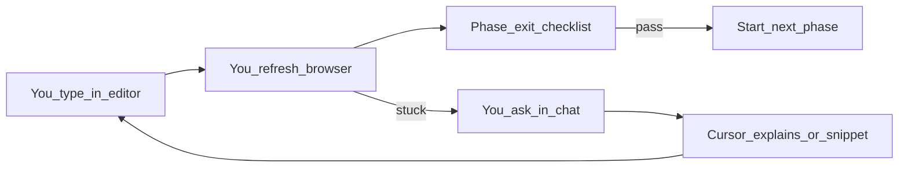
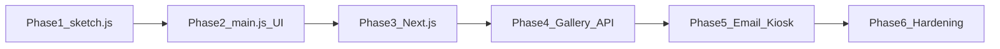
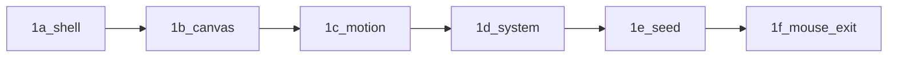
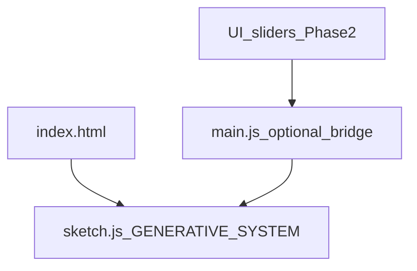
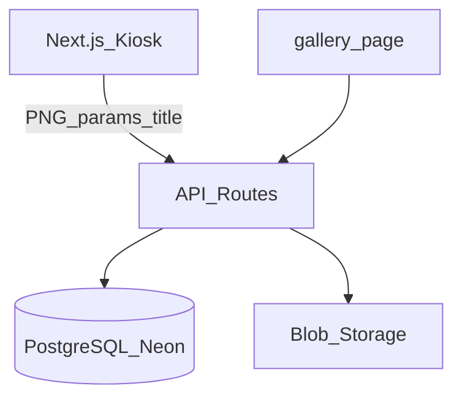

# Generative Art Museum Kiosk — Build Plan

## Guiding principle: layer, don’t boil the ocean

Follow the phased approach from [Creative Tool Stack](https://chatgpt.com/share/6a160c8d-591c-83ec-8c0e-9a4a3d63d133): **prove the art first**, then controls, then persistence and museum features.

**Locked decisions (unchanged)**

- **Art engine**: p5.js — all generative behaviour lives in the sketch
- **Hosting (later phases)**: Cloud (Vercel + Postgres + blob + Resend) — easiest to maintain for gallery + email
- **Visitors**: Optional display title only — no accounts or login
- **How you build**: **You type the code**; Cursor chat is your **guide** (explain, review, snippets, debug) — one phase at a time; see section below

---

## Coding with Cursor chat (how you’ll work)

You write the project yourself in the editor. Cursor is **not** a separate product you build — it’s a **conversation partner** while you implement each phase.

**Default mode:** you type → you run the browser → you ask when stuck.  
**Optional:** ask the agent to apply a small edit when you want speed (still your project, your pace).

### Workflow loop (every session)



| Step | You | Cursor chat |
|------|-----|-------------|
| 1. Orient | Open plan; note current phase + forbidden tech | Answer “what should I do next for Phase N?” |
| 2. Code | Create/edit `sketch.js`, `index.html`, etc. | Explain concepts; suggest snippets **you paste** |
| 3. Run | `npx serve .` or Live Server; test fullscreen later | Help fix console errors when you paste them |
| 4. Gate | Tick **exit checklist** yourself | Review: “does this meet Phase 1 exit?” |
| 5. Advance | Move to next phase only when checklist passes | Warn if you’re jumping ahead (e.g. DB in Phase 1) |

### What to type in chat (examples)

**Starting a phase**

- *“I’m starting Phase 1. What files should I create first and what goes in each?”*
- *“Walk me through `setup()` and `draw()` for a flow-field sketch — I’ll type it.”*

**While coding**

- *“Why isn’t my canvas fullscreen?”* (paste `style.css` + `index.html`)
- *“Explain `randomSeed` and where to call it in my sketch.”*
- *“This error in the console: …”*

**Review (you wrote it)**

- *“Here’s my `sketch.js` — does mouse interaction actually drive the visuals?”*
- *“Phase 1 checklist: which items am I missing?”*

**Scope guard**

- *“Should I add sliders now?”* → chat should say **wait for Phase 2**
- *“Can I use Next.js to go faster?”* → chat should say **not until Phase 3**

### Optional: when you want the agent to edit files

Say explicitly, e.g. *“Apply this change to sketch.js”* or *“Scaffold the Phase 1 files and I’ll tweak the art.”*  
Otherwise assume **guidance only** — you stay in control of every line.

### Rules to keep in chat (no custom agent to build)

- **No Phase 0 / no skills / no AGENTS.md required** — the plan + your messages are enough.
- **One phase focus** per session; mention *“still Phase 1”* when continuing later.
- **`sketch.js` owns the art** in Phases 1–2; chat shouldn’t push logic into many files.
- **You decide when a phase passes** — don’t start gallery/email until checklists are done.

### Handy chat openers (copy when useful)

| Phase | Type this when you begin |
|-------|--------------------------|
| 1 | *“Phase 1 — I’m building the generative instrument myself. Guide me through file setup and a first sketch.js; no React or backend.”* |
| 2 | *“Phase 2 — I have a working sketch. How do I wire sliders in main.js without breaking sketch.js?”* |
| 3 | *“Phase 3 — I need to port my sketch to Next.js instance mode; explain step by step, I’ll type it.”* |
| 4 | *“Phase 4 — Guide me through Prisma + save artwork API; one step at a time.”* |
| 5 | *“Phase 5 — How do I add Resend email and kiosk idle reset?”* |
| 6 | *“Phase 6 — What rate limiting should I add for a public museum kiosk?”* |

### Suggested session cadence

| Session | You typically | Chat role |
|---------|---------------|-----------|
| 1 | Scaffold files + first `draw()` loop | File layout, p5 basics |
| 2 | Refine motion / mouse / visual identity | Algorithms, debugging |
| 3 | Sliders + `main.js` bridge + PNG export | DOM + param wiring |
| 4+ | Backend / Next (one phase per session) | Step-by-step integration help |

---

## Phase roadmap (overview)

| Phase | Goal | Stack |
|-------|------|--------|
| **1** | Generative instrument feels alive | Vanilla HTML + p5.js |
| **2** | Parameter “lab” UI | + `main.js` sliders, `style.css` layout |
| **3** | App shell for museum features | Migrate to Next.js (sketch port) |
| **4** | Digital gallery | API + DB + image storage |
| **5** | Email + kiosk | Resend + fullscreen deploy |
| **6** | Exhibition hardening | Rate limits, admin, ops |



---

## Phase 1 — First working prototype (NOW)

**Success criterion**: Open browser → canvas immediately → mouse moves visuals → shapes animate/evolve → randomness creates variation.

> “Does the canvas feel alive and interesting?” — if yes, everything else is layering.

### Phase 1 subphases (build in order)

Complete **1a → 1f** before Phase 2. Each subphase is one focused sitting; chat when stuck.

| Subphase | Your from-scratch task | Done when |
|----------|------------------------|-----------|
| **1a — Project shell** | Create folder `generative-lab/`, `npm init -y`, `npm install p5`, add `.gitignore` with `node_modules` | `package.json` exists; p5 in `node_modules` |
| **1b — Page + blank canvas** | Write `index.html` (load p5 + `sketch.js`), `style.css` (fullscreen, no margin), minimal `sketch.js` (`createCanvas`, `background` in `draw`) | `npx serve .` → grey/black canvas, no errors |
| **1c — Something moves** | In `sketch.js`: one element animates every frame (`frameCount`, `sin`, moving circle/line) | You see continuous motion without mouse |
| **1d — Visual system** | Pick **one** idea and commit: nested grid squares, particle field, or flowing lines — many elements, one coherent look | Reads as intentional art, not random dots |
| **1e — Seed + variation** | `randomSeed()` in `setup()`; optional key (`r`) or reload changes seed; visuals differ per seed | Reload / new seed → clearly different layout |
| **1f — Mouse + Phase 1 exit** | Mouse `x`/`y` (or `pmouse`) modulates size, speed, hue, or density; run **exit checklist** + Chrome fullscreen test | All Phase 1 checklist boxes ticked |



**Skip for Phase 1:** `main.js` (Phase 2), sliders, save PNG, React, backend.

**Chat openers per subphase**

- 1a: *“Phase 1a — how do I load p5 from node_modules in index.html?”*
- 1b: *“Phase 1b — my canvas isn’t fullscreen, here’s my HTML/CSS.”*
- 1c: *“Phase 1c — simple animation in draw() using frameCount.”*
- 1d: *“Phase 1d — I want a grid of nested squares like X, where do I start?”*
- 1e: *“Phase 1e — explain randomSeed and when to call it.”*
- 1f: *“Phase 1f — mouse should control density; review my sketch.js.”*

### What you DO NOT build in Phase 1

- React, Next.js, Supabase, database, gallery, auth
- Multiple pages, build tooling beyond npm for p5
- Email, saving, deployment complexity

### Minimal file structure

```
generative-lab/
├── index.html      # container — loads p5, sketch, scripts
├── sketch.js       # THE ART ENGINE (most important)
├── main.js         # optional control bridge (can skip at first)
├── style.css       # fullscreen canvas, no margins, lab feel
├── package.json    # p5 dependency only
└── node_modules/
```

**Ultra-lean option**: `index.html` + `sketch.js` + `style.css` only (skip `main.js` until Phase 2).

### Mental model



| File | Role |
|------|------|
| **index.html** | Page structure; load p5.js, `sketch.js`, `main.js`; canvas mount; slider container placeholder |
| **sketch.js** | `setup()`, `draw()`, mouse interaction, visual system, noise/randomness, shape generation — **all artwork logic** |
| **main.js** | Shared params object; UI → sketch bridge (minimal in Phase 1; expand in Phase 2) |
| **style.css** | Fullscreen canvas, zero margins, installation-like presentation |

### sketch.js responsibilities (Phase 1)

- Responsive canvas (fullscreen or large centered)
- Mouse-driven modulation (position, pressure via `mouseX`/`mouseY`/`pmouseX`)
- Animated or evolving forms (not static screenshots)
- Seeded or controlled randomness so sessions feel varied but not pure noise
- One coherent visual system (grid, particles, nested shapes, flow field — pick one direction and refine)

### Phase 1 npm setup

- `npm init` + `npm install p5`
- Load p5 from `node_modules` in `index.html` (or CDN for fastest first open)
- Serve locally: `npx serve .` or VS Code Live Server

### Phase 1 exit checklist

- [ ] Canvas renders on load without errors
- [ ] Mouse movement clearly affects the piece
- [ ] Animation runs smoothly for several minutes
- [ ] Visual identity feels intentional (not default random circles)
- [ ] Works in Chrome fullscreen (manual test — kiosk config comes in Phase 5)

---

## Phase 2 — Parameter lab (still no backend)

**Goal**: Turn the instrument into something visitors can *play* — shapes, colours, timing, density — without leaving the vanilla stack.

### Add to existing files

- **index.html**: slider/control panel markup (shapes, palette, speed, density, seed/regenerate)
- **main.js**: owns `params` object; wires `input` events → updates sketch (via globals, `window.params`, or callbacks exposed from sketch)
- **sketch.js**: read `params` each frame or on change; use `randomSeed(params.seed)` for reproducibility
- **style.css**: side or bottom panel; large touch-friendly controls (48px+ targets for future kiosk)

### New capabilities

- “Regenerate” / new seed button
- `saveCanvas()` or export button → **download PNG locally** (proves export path before cloud upload)
- Fullscreen + hide browser chrome via CSS (`100vh`, `overflow: hidden`)

### Still avoid

- React, database, gallery, email, Next.js

### Phase 2 exit checklist

- [ ] 6–8 parameters mapped and visibly affect the sketch
- [ ] Same seed + params reproduce the same image
- [ ] PNG export works from the browser
- [ ] Layout usable on a laptop screen at arm’s length

---

## Phase 3 — Migrate to Next.js app shell

**Goal**: Move proven `sketch.js` logic into the app framework used for gallery/email — without changing how the art *feels*.

### Target structure (replaces flat HTML site)

```
generative-art-lab/
├── app/page.tsx              # kiosk create (port Phase 2 UI)
├── components/P5Canvas.tsx   # p5 instance mode or @p5-wrapper/react
├── lib/artParams.ts          # params schema from Phase 2 main.js
├── sketches/museumPiece.ts   # port of sketch.js
└── public/
```

### Migration notes

- Port **sketch.js → `sketches/museumPiece.ts`** (instance mode avoids React conflicts)
- Port **params + wiring from main.js → React state + `artParams.ts`**
- Port **style.css → Tailwind** (keep fullscreen + panel layout)
- **Parity test**: same seed/params produce visually equivalent output to Phase 2

### Tech (starts here, not Phase 1)

| Layer | Choice |
|-------|--------|
| Framework | Next.js 15 App Router |
| Styling | Tailwind CSS |
| Generative | p5.js instance mode |

---

## Phase 4 — Digital gallery (cloud backend)

**Goal**: “Save to gallery” with optional title; public exhibition grid.

### Architecture



### API (v1)

- `POST /api/artworks` — `{ imageBase64, params, title?, seed }`
- `GET /api/artworks` — paginated gallery
- `GET /api/artworks/[id]` — single work + share URL

### Data model (Prisma)

```prisma
model Artwork {
  id        String   @id @default(cuid())
  createdAt DateTime @default(now())
  title     String?
  seed      Int
  params    Json
  imageUrl  String
  published Boolean  @default(true)
}
```

### Backend stack

| Layer | Choice |
|-------|--------|
| API | Next.js Route Handlers |
| Database | PostgreSQL (Neon or Supabase) |
| ORM | Prisma |
| Images | Vercel Blob or Supabase Storage |

---

## Phase 5 — Email + museum kiosk

**Goal**: Visitor emails their work; laptop runs reliably in the gallery.

### Email

- `POST /api/artworks/[id]/email` with `{ email }`
- **Resend** — image attachment or link to `/artwork/[id]`
- Short privacy line on form; do not store emails in v1

### Kiosk UX

- Attract mode after idle (~60s)
- Session “Start over” always visible
- Optional on-screen keyboard for email field
- Error + retry for failed save/email

### Deployment

1. Deploy to Vercel; env: `DATABASE_URL`, `BLOB_*`, `RESEND_API_KEY`
2. Museum laptop: Chrome kiosk/fullscreen → production URL on boot
3. Optional second display: `/gallery` fullscreen
4. QR code to gallery for phones

---

## Phase 6 — Exhibition hardening

- Rate-limit save and email endpoints
- Env-guarded admin route to hide/unpublish works
- WebP compression; max image dimensions
- Optional Sentry for API errors

---

## End-state user flows (Phases 4–5)

1. **Create** — Adjust parameters → live preview → optional title → save to gallery
2. **Gallery** — Newest-first grid for exhibition screen or `/gallery`
3. **Email** — Optional email step with artwork link/image
4. **Reset** — Clear session; idle → attract mode

---

## What moves where (sketch continuity)

| Concern | Phase 1–2 | Phase 3+ |
|---------|-----------|----------|
| Generative logic | `sketch.js` | `sketches/museumPiece.ts` |
| Parameters | `main.js` + DOM | `lib/artParams.ts` + React |
| Layout | `style.css` | Tailwind |
| Save/share | local PNG download | API + blob + gallery |
| Run locally | `npx serve` | `npm run dev` |

**Rule**: Do not rewrite the visual system when migrating — **port and wrap** the working sketch.

---

## Cost and maintenance (Phases 4+)

- Vercel + Neon + Blob + Resend: typically $0–low tens/month at museum traffic
- Phase 1–2: zero hosting cost — local files only
- Maintenance: quarterly dependency updates; art changes = edit sketch only

---

## Security (Phases 4–6)

- Rate-limit `POST /api/artworks` and `/email`
- Validate email format; GDPR copy if storing emails later
- CAPTCHA only if abuse appears

---

## Next action

**Start Phase 1a now** (from scratch):

1. `mkdir generative-lab && cd generative-lab`
2. `npm init -y && npm install p5`
3. Tell chat: *“Phase 1a done — guide me through 1b index.html and blank sketch.”*

Work **1a → 1f** in order; only start Phase 2 after the Phase 1 exit checklist passes.
